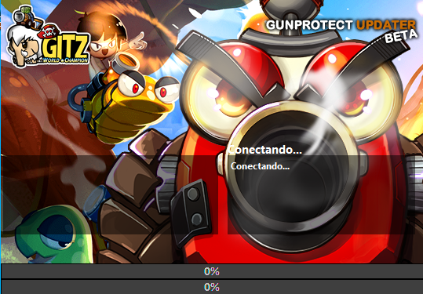

<h1  align="center">Delphi Updater Program</h1>

A beautiful auto updater program made in Delphi 7 to update files in source folder. 
    

  <h3>Menu: 
    <a href="#preview">Preview</a> | 
    <a href="#features">Features</a> | 
    <a href="#how-to-run">How to Run</a> | 
    <a href="#about-me">About</a>
  </h3>
  
Made with ❤︎ by <a href="https://github.com/zC4sTr0">Gabriel Castro</a>

# Preview

 
# Features

## Updater widely tested and with fast hash
The Updater with Blake hash algorithm has been carefully designed to ensure a smooth and efficient update process for GunBound GitzWC. The updater is written in Pascal and compiled with Delphi, and it has been extensively tested on over 3,000 computers worldwide.

## Thread Support
One of the key features of this updater is its support for threads, which allows for smooth file downloads without freezing the user interface. This means that users can continue to use their computers without interruption while the updater does its work.

## Supports Compressed ZIP Files with Passwords
The PascalUpdater also supports compressed ZIP files with passwords, which can be particularly useful in avoiding antivirus software issues during the download process. The extraction process is fast, but users may be able to achieve even better results by changing the compression algorithm. 
The Updater also extract the ZIP sucessfully (all with progress bars!)

## File Hash Check
To ensure that only the necessary files are updated, the PascalUpdater uses a file called "filelist.dat" which contains the names, sizes, and Blake-256 hashes of all the files required for the update. The updater compares the hashes of the files in the client folder with those in the filelist.dat file to ensure that the files are up-to-date and unmodified. This feature ensures that the update process is not only efficient but also secure.

## Blake Hash Algorithm

In order to ensure that files are up-to-date, the PascalUpdater uses the fast and accurate Blake-256 algorithm to calculate hashes.  
The Blake-256 hash algorithm is a cryptographic hash function that produces a 256-bit hash value. It was created by Jean-Philippe Aumasson, Samuel Neves, Zooko Wilcox-O'Hearn, and Christian Winnerlein. The algorithm is named after one of the creators, Jean-Philippe Aumasson's, newborn son Blake.

The Blake-256 algorithm is known for its speed and security. It has been extensively analyzed and tested, and is widely regarded as a secure and reliable hash function. The algorithm uses a combination of cryptographic techniques, including keying, message padding, and data compression, to produce its hash values.

In the context of the Updater, the Blake-256 hash algorithm is used to ensure the integrity and authenticity of the downloaded files. When a file is downloaded, the PascalUpdater calculates the hash value of the file using the Blake-256 algorithm. The calculated hash value is then compared to the expected hash value stored in the filelist.dat file. If the calculated hash value matches the expected hash value, the file is deemed to be authentic and can be installed. If the hash values do not match, the file is considered to be corrupt or tampered with, and the updater will not install it.

Overall, the Blake-256 hash algorithm is an excellent choice for ensuring the security and integrity of downloaded files. Its speed and reliability make it a popular choice in a variety of applications, including the PascalUpdater used in GunBound GitzWC.

In summary, the PascalUpdater with Blake hash algorithm is a powerful tool for updating files efficiently and quickly. Its support for threads and compressed ZIP files with passwords make it an excellent choice for anyone who wants to avoid issues that may arise during the download process, such as antivirus software problems.

## Background Image Support
The PascalUpdater supports a custom background image for the updater interface. If the image file exists in the same folder as the updater executable, it will be loaded and displayed as the background. This feature adds a nice touch of customization to the updater.

## Task Killing
The updater is able to kill specific processes before updating, which helps to ensure that there are no conflicts or issues with running programs. The following processes are targeted: "GitzGame.exe," "NyxLauncher.exe," "UpdaterReplacer.exe," and "GbSet.exe." Killing these processes helps to ensure a smooth update process.

## Multi-Language Support
The updater have support in English, Portugues and Spanish languages and it's very easy to add more languages.

## File Deletion
The updater also has the ability to delete files before updating, which can be useful in ensuring that old files are not left behind. The following files are deleted: ".tmp," ".bak," "*.gp," "replacelist.dat," and "filelist.dat."

## Updater.ini Creation
If the updater.ini file does not exist in the same folder as the updater executable, the updater will create it and save it. This file is used to configure the updater settings, such as the FTP host, user credentials, and update files.

# How to run

To run this applications, you must have Delphi 7+ installed in your computer.

Read more about how to Install Delphi here: https://www.embarcadero.com/br/products/delphi/starter/free-download

# About me

<h3  align="center"> I'm Gabriel Castro and I love coding softwares!</h3>

I'm a Lifelong learner, software developer, I study economy, blockchains, tech, astronomy and history. Intelectually generalist, I have interests in many fields of science. 
  
###### I talk about Bitcoin, web3, and economy on my twitter:

    

 My twitter is worth to check since it has 2 years of recorded proofs of my true love about economy, bitcoin and my own travel through the bitcoin's rabbit hole.

- 🔭 I’m currently working on [GunBound GITZ](www.gitzwc.com) as Founder/CEO

- 🌱 I’m currently studying **Solidity, Python and React Native**

- 👨‍💻 All of my projects are available at [www.github.com/zC4sTr0](www.github.com/zC4sTr0)

- 📫 How to reach me: **gabriel.sodre@aluno.ufop.edu.br**

<h3  align="left">Connect with me:</h3>

<h3  align="left">Languages and Tools:</h3>

  

                          
